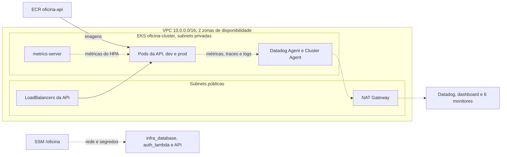

# fiap_tech_challenge_oficina_infra_k8s

Terraform da base compartilhada da oficina: rede, cluster EKS, registro de imagens, segredos por ambiente e monitoramento com Datadog. Faz parte do Tech Challenge Fase 3:

| Repositório | Responsabilidade |
|---|---|
| [fiap_tech_challenge_oficina_api](https://github.com/gabrielov2003/fiap_tech_challenge_oficina_api) | Aplicação principal, no EKS |
| [fiap_tech_challenge_oficina_auth_lambda](https://github.com/gabrielov2003/fiap_tech_challenge_oficina_auth_lambda) | Autenticação por CPF e API Gateway |
| fiap_tech_challenge_oficina_infra_k8s | Este repositório. Rede, cluster EKS, segredos e Datadog |
| [fiap_tech_challenge_oficina_infra_database](https://github.com/gabrielov2003/fiap_tech_challenge_oficina_infra_database) | Banco de dados RDS PostgreSQL |

## Arquitetura



## O que é provisionado

| Arquivo | Recursos |
|---|---|
| `main.tf` | VPC com subnets públicas e privadas em 2 zonas e NAT Gateway, EKS 1.34 com 1 a 3 nós `c7i-flex.large` (2 desejados) e ECR `oficina-api` com scan e as 20 imagens mais recentes |
| `kubernetes.tf` | metrics-server, usado pelo HPA, e agente do Datadog com logs, APM, DogStatsD e cluster agent |
| `datadog.tf` | Dashboard "Oficina, visão operacional" e 6 monitores: falhas no processamento de OS, latência alta, API fora do ar, CPU alta nos pods, erros no webhook e erros na Lambda |
| `ssm.tf` | Parâmetros de rede e do cluster, e segredos gerados para cada ambiente |

Os nós usam `c7i-flex.large` porque contas no plano gratuito da AWS só aceitam alguns tipos de instância. Pelo mesmo motivo o IRSA está desligado (`enable_irsa = false`), já que essas contas bloqueiam a criação do OIDC provider.

## Parâmetros publicados no SSM

| Parâmetro | Tipo | Quem usa |
|---|---|---|
| `/oficina/network/vpc_id` | String | infra_database e auth_lambda |
| `/oficina/network/vpc_cidr` | String | infra_database, para liberar o banco para a VPC |
| `/oficina/network/private_subnet_ids` | StringList | infra_database e auth_lambda |
| `/oficina/eks/cluster_name` | String | Pipeline da API |
| `/oficina/<env>/jwt_secret` | SecureString | API (validação) e Lambda (assinatura) |
| `/oficina/<env>/webhook_token` | SecureString | API |
| `/oficina/<env>/admin_password` | SecureString | API, senha inicial do admin |

Os segredos são gerados pelo Terraform, então nenhum valor sensível fica no repositório ou nos secrets do GitHub.

## Ambientes

A infraestrutura é única. `dev` e `prod` se separam por namespace, schema no banco, segredos, Lambda e API Gateway. Por isso a branch `dev` roda só o `plan`, e a `main` aplica.

## Como provisionar manualmente

Pré-requisitos: Terraform 1.10+, AWS CLI configurado e, opcionalmente, as chaves do Datadog. Crie uma vez o bucket do estado, usado pelos três repositórios de Terraform. Fora da `us-east-1`, acrescente `--create-bucket-configuration LocationConstraint=REGIAO` no primeiro comando.

```bash
aws s3api create-bucket --bucket NOME_DO_BUCKET --region us-east-1
aws s3api put-bucket-versioning --bucket NOME_DO_BUCKET --versioning-configuration Status=Enabled
```

```bash
terraform init -backend-config="bucket=NOME_DO_BUCKET" -backend-config="key=infra-k8s/terraform.tfstate" -backend-config="region=us-east-1" -backend-config="use_lockfile=true"
terraform apply -target=module.vpc -target=module.eks
terraform apply
aws eks update-kubeconfig --region us-east-1 --name oficina-cluster
```

O primeiro `apply` cria a rede e o cluster antes dos recursos que dependem deles (Helm).

## Dashboard e alertas sem a AWS

Dá para criar só o dashboard e os alertas, com estado local, usando os dados do `docker-compose.datadog.yml` da API (tag `env:local`):

```bash
printf 'terraform {\n  backend "local" {}\n}\n' > backend_override.tf
export TF_VAR_datadog_api_key=SUA_API_KEY TF_VAR_datadog_app_key=SUA_APP_KEY TF_VAR_datadog_site=datadoghq.com
terraform init
terraform apply -target=datadog_dashboard.oficina -target=datadog_monitor.falhas_os -target=datadog_monitor.erros_integracao -target=datadog_monitor.latencia_api -target=datadog_monitor.healthcheck_api
```

No dashboard, troque a variável `env` para `local`. Depois, rode o mesmo comando com `destroy` e apague o `backend_override.tf` (fica fora do Git) e a pasta `.terraform`.

## Variáveis principais

| Variável | Uso | Padrão |
|---|---|---|
| `region` | Região AWS | `us-east-1` |
| `node_instance_type` | Tipo dos nós, precisa estar na lista do Free Tier em contas no plano gratuito | `c7i-flex.large` |
| `datadog_api_key` | Sem ela o agente não é instalado | |
| `datadog_app_key` | Sem ela o dashboard e os alertas não são criados | |
| `datadog_site` | Site do Datadog | `datadoghq.com` |
| `datadog_alert_email` | Email avisado pelos alertas | |
| `admin_principal_arns` | ARNs extras com acesso de admin ao cluster, útil ao aplicar com um usuário diferente do pipeline | `[]` |

Lista completa em `variables.tf`. Outputs úteis: `configure_kubectl`, `ecr_api_url` e `datadog_dashboard_url`.

## CI/CD

| Job | Quando roda | O que faz |
|---|---|---|
| `validate` | Pull requests e pushes em `dev` e `main` | `terraform fmt` e `terraform validate` |
| `terraform` | Depois do validate | `plan` em pull requests e na `dev`, `apply` no push para `main` |

Secrets: `AWS_ACCESS_KEY_ID`, `AWS_SECRET_ACCESS_KEY`, `DD_API_KEY` e `DD_APP_KEY`. Variáveis: `TF_STATE_BUCKET` e, opcionais, `AWS_REGION`, `DD_SITE` e `DD_ALERT_EMAIL`. Sem credenciais AWS, o pipeline para depois da validação.

## Ordem de deploy e custos

Primeiro deploy: este repositório, depois `infra_database`, a API e por último a `auth_lambda`.

EKS, NAT Gateway, LoadBalancers e RDS são cobrados por hora e consomem os créditos da conta. Para desligar tudo, na ordem inversa: `terraform destroy` na `auth_lambda` (em cada ambiente), `kubectl delete namespace dev prod` para remover os LoadBalancers, `terraform destroy` no `infra_database` e por último neste repositório.

## Documentação

RFCs, ADRs, diagramas e roteiro do vídeo: [documentacao_fase3](https://github.com/gabrielov2003/TechChallenge1/tree/main/documentacao_fase3).

---
Este projeto faz parte do Tech Challenge da Pós Graduação em Arquitetura de Software da FIAP.
